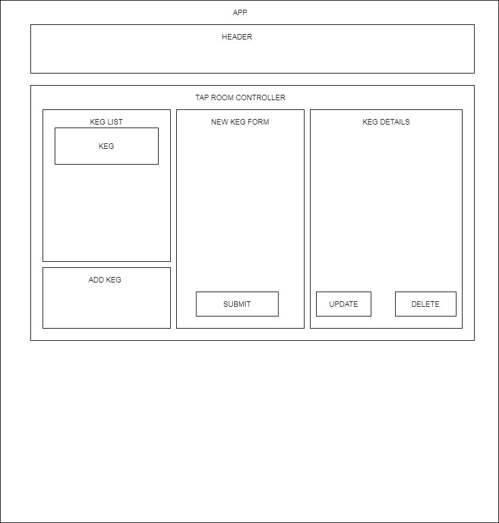

# _Tap-Room_

#### _Epicodus Project React Fundamentals Tap-Room, 11/20/2020_

#### By _**William Donovan-Seid**_

## Description

_This is an Epicodus Friday Project in using React Fundamentals to create web application where a bar can track their kegs._

## Component Diagram

## Setup/Installation Requirements

* _Clone Repository_
* _Navigate to root directory in your terminal_
* _Run "npm run start" in your terminal_

## Known Bugs

_There are no known bugs at this time._

## Support and contact details

_If there are any questions or concerns, feel free to contact us at wdstwo@live.com._

## Technologies Used

* _React_
* _HTML_
* _JavaScript_
* _CSS_

### Other Links

* [Will's GitHub](https://github.com/wdonovanseid)

### License

This software is licensed under the MIT license.

Copyright (c) 2020 **_William Donovan-Seid_**